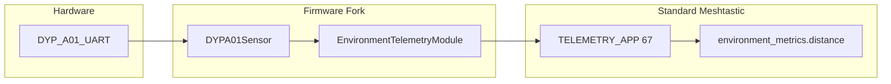

# DYP-A01 Ultrasonic Sensor Driver (Phase 1)

## Scope (this iteration)

**In scope:** DYP-A01 horn ultrasonic (Adafruit 4664) over UART → `EnvironmentMetrics.distance` (mm).

**Out of scope for now:** Rika RK900-12 weather station / Modbus / RS485 (documented as future Phase 2).

## Target boards

| Priority                    | Board                       | PlatformIO env     | Role                                                                       |
| --------------------------- | --------------------------- | ------------------ | -------------------------------------------------------------------------- |
| **1 — dev/debug now**       | Heltec V3 (ESP32-S3)        | `heltec-v3`        | Bench bring-up: USB serial logging, easy flash, spare UART on Grove header |
| **2 — production**          | Seeed Solar Node (nRF52840) | `seeed_solar_node` | Primary deployment target                                                  |
| **3 — production fallback** | RAK4631 WisBlock (nRF52840) | `rak4631`          | Alternate; `PIN_SERIAL2` already defined                                   |

Implement the driver **once**, board-agnostic except for pin/UART instance defines in each `variant.h`.

---

## Short answers (unchanged)

**Custom packet type?** No — reuse `TELEMETRY_APP` (67) + `Telemetry.environment_metrics` + existing `distance` field (same semantic as `[RCWL9620Sensor](src/modules/Telemetry/Sensor/RCWL9620Sensor.cpp)`).

**uNew VANILLA flavour?** No — leave `USERPREFS_FIRMWARE_EDITION` and `USERPREFS_EVENT_MODE` unset. See plan section on edition vs event mode below if needed.



---

## Branch strategy

**Baseline:** `v2.7.15.567b8ea`

```bash
git fetch --tags
git checkout -b custom-sensors v2.7.15.567b8ea
git submodule update --init
```

Merge new stable betas into `custom-sensors` periodically; driver code stays behind `#ifdef HAS_DYP_A01`.

---

## DYP-A01 protocol

Per [datasheet](https://cdn-shop.adafruit.com/product-files/4664/4664_datasheet.pdf):

- **UART:** 9600 8N1 TTL
- **Mode (initial):** UART auto-output — passive read on sensor TX
- **Frame:** `0xFF`, `Data_H`, `Data_L`, `SUM` where `SUM = (0xFF + Data_H + Data_L) & 0xFF`
- **Distance:** `Data_H * 256 + Data_L` → millimetres
- **Range (horn):** ~280–7500 mm

---

## Implementation — shared driver

**Pattern:** UART board-specific driver (like `[IndicatorSensor](src/modules/Telemetry/Sensor/IndicatorSensor.cpp)`), **not** I2C scan in `[main.cpp](src/main.cpp)`.

### New files

`src/modules/Telemetry/Sensor/DYPA01Sensor.h` / `.cpp`

- Subclass `TelemetrySensor` with `meshtastic_TelemetrySensorType_DYP_A01`
- `runOnce()`: init `HardwareSerial` (ESP32) or `Serial2` (nRF52) at 9600 on `DYP_A01_UART_RX` / `DYP_A01_UART_TX`
- Background: read bytes, sync on `0xFF`, validate checksum, store latest distance
- `getMetrics()`: set `has_distance` + `distance`
- **Debug:** `LOG_INFO` / `LOG_DEBUG` parsed distance and checksum failures (visible on USB serial for Heltec)

### Wire into EnvironmentTelemetry

In `[EnvironmentTelemetry.cpp](src/modules/Telemetry/EnvironmentTelemetry.cpp)`:

```cpp
#ifdef HAS_DYP_A01
#include "Sensor/DYPA01Sensor.h"
// global instance + addSensor<DYPA01Sensor>(...) in runOnce init block
// getEnvironmentTelemetry(): dypA01Sensor.getMetrics(m)
#endif
```

Mirror the `#ifdef SENSECAP_INDICATOR` / `IndicatorSensor` pattern (~lines 130–189).

### Protobuf

`[telemetry.proto](protobufs/meshtastic/telemetry.proto)`: add `DYP_A01 = 36` to `TelemetrySensorType` (local hardware ID only — **not** OTA packet format). Regenerate `telemetry.pb.h`.

---

## Board-specific pins

### Heltec V3 — dev target (implement first)

Files: `[variants/esp32s3/heltec_v3/variant.h](variants/esp32s3/heltec_v3/variant.h)`, `[platformio.ini](variants/esp32s3/heltec_v3/platformio.ini)`

Heltec V3 has no GPS consuming a UART; Grove header uses secondary I2C pins (`I2C_SDA1` / `I2C_SCL1` → board `SDA`/`SCL`, typically **GPIO 17 / 18**). Repurpose as UART for bench wiring:

| Signal            | GPIO | Notes                                      |
| ----------------- | ---- | ------------------------------------------ |
| `DYP_A01_UART_RX` | 17   | MCU RX ← sensor TX                         |
| `DYP_A01_UART_TX` | 18   | MCU TX → sensor RX (optional in auto mode) |

Add to `variant.h`:

```c
#define HAS_DYP_A01 1
#define DYP_A01_UART_RX 17
#define DYP_A01_UART_TX 18
#define DYP_A01_UART_BAUD 9600
```

Add to `platformio.ini` `build_flags`: `-D HAS_DYP_A01=1` (or rely on variant.h define).

**Dev workflow:**

```bash
pio run -e heltec-v3 -t upload
pio device monitor   # watch LOG_INFO distance readings
```

Enable `moduleConfig.telemetry.environment_measurement_enabled` via app or default in module init.

**Wiring tip:** DYP-A01 is 3.3–5 V tolerant; power from Heltec 3.3 V or 5 V if available; common ground required.

### Seeed Solar Node — production (port after Heltec works)

Files: `[variants/nrf52840/seeed_solar_node/variant.h](variants/nrf52840/seeed_solar_node/variant.h)`

- **Serial1:** GPS (D6/D7) — do not use
- **Serial2:** undefined today — assign to **Grove D14/D15** (`PIN_WIRE_SDA` / `PIN_WIRE_SCL`)

```c
#define PIN_SERIAL2_RX 15   // D15 / P0.10 — sensor TX
#define PIN_SERIAL2_TX 14   // D14 / P0.09 — sensor RX
#define HAS_DYP_A01 1
#define DYP_A01_UART_RX PIN_SERIAL2_RX
#define DYP_A01_UART_TX PIN_SERIAL2_TX
```

**Caveat:** Grove cannot be I2C and UART simultaneously; disable external I2C sensors on this build or use a different header.

### RAK4631 — production fallback

Files: `[variants/nrf52840/rak4631/variant.h](variants/nrf52840/rak4631/variant.h)`

Existing `PIN_SERIAL2_RX=8`, `PIN_SERIAL2_TX=6` — map `DYP_A01_UART_`\* to these (or WisBlock UART port pins if using a module). Enable `HAS_DYP_A01` in `rak4631/platformio.ini` when ready.

---

## Multi-board abstraction contract

All variants that enable the sensor must define:

| Define              | Purpose                                      |
| ------------------- | -------------------------------------------- |
| `HAS_DYP_A01`       | Compile driver + EnvironmentTelemetry wiring |
| `DYP_A01_UART_RX`   | MCU receive pin                              |
| `DYP_A01_UART_TX`   | MCU transmit pin                             |
| `DYP_A01_UART_BAUD` | Default 9600                                 |

Driver selects `HardwareSerial` instance by architecture:

- **ESP32:** `Serial1.begin(baud, SERIAL_8N1, RX, TX)`
- **nRF52:** `Serial2.begin(baud)` after pins set in variant

---

## Testing plan (Phase 1)

### Heltec V3 (now)

1. `pio run -e heltec-v3` — clean build
2. Flash + monitor: confirm `0xFF` frames parse, checksum OK, distance plausible
3. Enable environment telemetry in app; confirm `distance` appears
4. Optional: MQTT decode via `[MeshPacketSerializer.cpp](src/serialization/MeshPacketSerializer.cpp)` — no code changes expected

### Seeed / RAK4631 (after port)

1. Repeat build/flash for `seeed_solar_node` and `rak4631`
2. Verify UART on assigned pins; check power budget on solar node
3. Controlled-output mode (RX trigger) as power-saving follow-up

---

## Future Phase 2 — RK900-12 (deferred)

RS485 Modbus RTU weather station. Requires new `ModbusRtu` helper, `RS485_DE_PIN`, `RIKA_RK90012` enum entry, and register map from unit manual. Maps to existing `EnvironmentMetrics` wind/temp/humidity/pressure/rainfall fields. **Not started in this iteration.**

---

## What you do not need

| Item                           | Needed?                       |
| ------------------------------ | ----------------------------- |
| New mesh portnum / packet type | No                            |
| New `FirmwareEdition`          | No — stay VANILLA             |
| New PlatformIO board env       | No — extend existing variants |
| Meshtastic app fork            | No                            |

### Firmware edition vs event mode (reference)

`FirmwareEdition` (VANILLA, BURNING_MAN, …) is metadata in `MyNodeInfo` — not read by firmware for behavior. `USERPREFS_EVENT_MODE` is the compile-time flag that changes hop limits, MQTT, position intervals, etc. Leave both unset.

---

## Suggested file layout

```
src/modules/Telemetry/Sensor/
  DYPA01Sensor.h
  DYPA01Sensor.cpp
variants/esp32s3/heltec_v3/
  variant.h          # pins + HAS_DYP_A01 (first)
  platformio.ini     # build flag
variants/nrf52840/seeed_solar_node/variant.h   # port later
variants/nrf52840/rak4631/variant.h            # port later
protobufs/meshtastic/telemetry.proto           # DYP_A01 = 36
```

---

## Risks

- **Heltec Grove pin numbers:** confirm GPIO 17/18 against your board revision schematic before soldering
- **Seeed Serial2 vs Grove I2C:** mutually exclusive on D14/D15
- **Protobuf enum slot:** renumber `DYP_A01` if upstream adds enum values before merge
- **Checksum / framing:** reject bad frames; do not publish stale distance on parse failure
